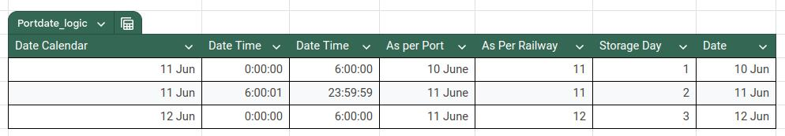

## Kict

KICT customization

**1. Batch 'Manufacturing Date' is set as per port logic when auto batch is created from Stock Entry(SE) when type is 'Cargo Received'**

Ex.  
SE.posting_date = 01-06-2024  
SE.posting_time = 04:00:00  
Batch.Manufacturing Date is 31-05-2024  

**2. Royalty PI : cargo handling qty(i.e In Coal Settings when you press Create-->Create Royalty Invoice)**

For June month, SLE posting date time to be considered between  
port_start_date_with_time : 2024-02-01 06:00:01  
port_next_month_end_date_with_time : 2024-03-01 06:00:00  

**3. In all storage repots i.e Storage Charges,Royalty Storage,Basic Storage Entries**

'Date wise' column shows date as per port logic for Receipt qty >0  
Ex SLE has 01-06-2024 04:00:00 then in 'Date wise' column will show 31-05-2024  

#### Contact Us

  
1st ERPNext [Certified Partner](https://frappe.io/api/method/frappe.utils.print_format.download_pdf?doctype=Certification&name=PARTCRTF00002&format=Partner%20Certificate&no_letterhead=0&letterhead=Blank&settings=%7B%7D&_lang=en#toolbar=0)
  
& winner of the [Best Partner Award](https://frappe.io/partners/india/greycube-technologies)   

<h5>
  <a href="https://greycube.in"> greycube.in</a> 
  <a href="mailto:sales@greycube.in"> 
 sales@greycube.in</a> 
  <a href="https://www.linkedin.com/company/greycube-technologies"> LinkedIn</a> 
 <a href="https://greycube.in/blog"> Blogs</a> </h5>

#### License

unlicense
