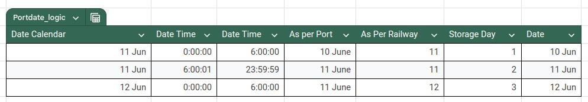

## Kict

KICT customization



**1. Batch 'Manufacturing Date' is set as per port logic when auto batch is created from Stock Entry(SE) when type is 'Cargo Received'**

Ex. <br>
SE.posting_date = 01-06-2024 <br>
SE.posting_time = 04:00:00 <br>
Batch.Manufacturing Date is 31-05-2024 <br>

**2. Royalty PI : cargo handling qty(i.e In Coal Settings when you press Create-->Create Royalty Invoice)**

For June month, SLE posting date time to be considered between <br>
port_start_date_with_time : 2024-02-01 06:00:01 <br>
port_next_month_end_date_with_time : 2024-03-01 06:00:00 <br>

**3. In all storage repots i.e Storage Charges,Royalty Storage,Basic Storage Entries**

'Date wise' column shows date as per port logic for Receipt qty >0 <br>
Ex SLE has 01-06-2024 04:00:00 then in 'Date wise' column will show 31-05-2024 <br>

<hr>

#### Contact Us

<a href="https://greycube.in"></a> <br>
1<sup>st</sup> ERPNext [Certified Partner](https://frappe.io/api/method/frappe.utils.print_format.download_pdf?doctype=Certification&name=PARTCRTF00002&format=Partner%20Certificate&no_letterhead=0&letterhead=Blank&settings=%7B%7D&_lang=en#toolbar=0)
<sub>  </sub>
& winner of the [Best Partner Award](https://frappe.io/partners/india/greycube-technologies) <sub>  </sub>

<h5>
<sub> </sub> <a href="https://greycube.in"> greycube.in</a><br>
<sub> </sub> <a href="mailto:sales@greycube.in"> 
 sales@greycube.in</a><br>
<sub> </sub> <a href="https://www.linkedin.com/company/greycube-technologies"> LinkedIn</a><br>
<sub> </sub><a href="https://greycube.in/blog"> Blogs</a> </h5>

#### License

unlicense


# KICT — How the System Works (Functional Guide)

**For:** Operations, Commercial, Accounts, and MIS teams
**Purpose:** Explain how the KICT system tracks a ship's cargo from arrival to billing, in plain
business language — no code, no technical jargon.

KICT stands for Kalinga International Coal Terminal, Paradip. This system manages everything that
happens to a shipload of coal from the moment the vessel arrives until every tonne has left the
port and every rupee has been billed — to the customer, and separately, as royalty owed to the
terminal.

---

## 1. The most important rule in the whole system: the "Port Day"

Before anything else, you need to understand this one rule, because it quietly affects batch
dates, storage-day counting, and monthly royalty billing throughout the system.

**In a normal calendar, the day changes at midnight (12:00 AM). In this system, the terminal's
"working day" changes at 6:00 AM instead.**

Think of it like a 24-hour port operation running in two long shifts that don't line up with the
calendar. Anything that happens **at or before 6:00 AM** is still counted as belonging to
**yesterday**. Only once the clock passes 6:00 AM does the system consider it a new day.

```
 11 PM        midnight        3 AM        6 AM  |  9 AM        noon
   |               |            |           |    |    |            |
   └───────────────── still counted as "YESTERDAY" ────┘
                                                  |
                                                  └── NOW it becomes "TODAY"
```

### Why this matters

Coal handling at the port doesn't stop at midnight — a discharge shift can easily run from
evening until early morning. If the system used the calendar date, a single continuous
overnight shift would get artificially split into two different "days" right at midnight, which
would mess up:
- Which day a batch of cargo is dated,
- How many free storage days a customer has used,
- Which calendar month a vessel's berth-hire hours and cargo tonnage get billed under.

The 6 AM rule fixes this by treating the whole overnight shift as a single day that only ends once
6 AM comes around.

### Where you will actually see this rule in action

**1. When a batch is created for cargo received.**
Every time cargo is unloaded from a vessel and entered into the system as "Cargo Received," a
batch is created (or reused) for that lot. The batch's date is set using the port-day rule, not
the plain calendar date.

> **Real example from the system:** Cargo was entered on **9-Jul-2024 at 6:00 AM sharp**. Because
> 6:00 AM is still counted as "on or before" the cut-off, the batch created for this entry was
> dated **8-Jul-2024** — the previous day — not the 9th.
>
> Another real example: cargo entered on **8-Aug-2024 at 6:00 AM** produced a batch dated
> **7-Aug-2024**.

If the same cargo had instead been entered at 6:01 AM, it would have been dated on the actual
calendar day, with no shift.

**2. When counting how many days cargo has been sitting in storage.**
Storage-day counting (used both for customer storage-charge billing and for royalty billing to
the terminal) starts counting "Day 1" from the port day the cargo arrived, not the plain calendar
date. So cargo that technically arrived just after midnight but before 6 AM has its "Day 1" backed
up to the previous day.

**3. In all three storage reports** (Basic Storage Entries, Storage Charges, and Royalty
Storage), the "Date wise" column that groups cargo movements by day uses the port-day, not the
calendar day — but **only for incoming cargo (receipts)**. Cargo going *out* is always shown on
its actual calendar date; only the receipt side gets shifted. This asymmetry is intentional and is
called out in the system's own notes, but it is easy to forget if you're reconciling numbers.

**4. When generating the monthly royalty invoice.**
Royalty is billed to the terminal once a month, and the month's boundaries are also shifted by 6
hours because of this rule. For example, when billing for the month of June, the system doesn't
use "1st June 00:00 to 30th June 23:59" — it uses **"1st June 6:00:01 AM through 1st July 6:00
AM."** This way, a night shift that started on 31st May but ran past midnight into 1st June
(before 6 AM) is correctly excluded from June's billing and kept in May's, and a night shift that
started on 30th June and ran into 1st July (before 6 AM) is correctly still counted as June's
activity.

**5. When splitting a vessel's berth-hire stay hours across two billing months.**
If a vessel stays in port across a month-end, the total number of hours it occupied the berth
needs to be split between "this month" and "next month" for royalty purposes. That split point is
also calculated as 6:00 AM on the first day of the new month, not midnight.

### Where this rule does *not* apply

It's worth knowing that this 6 AM rule is **only** used for cargo storage, batch-dating, and
royalty billing. It is **not** applied to:
- The railway/rake side of the business (rake arrival, wagon loading, freight billing) — those
  use plain calendar dates and times throughout.
- Day-to-day operational logs — hourly discharge logging, equipment in/out records, delivery
  order releases to agents, gate passes, and staff meal records — all of these use plain calendar
  dates with no 6 AM adjustment.

So if you're ever comparing a "day" on a rake/railway document against a "day" on a storage or
billing document, remember they may not be using the same definition of "day."

One more note: this rule has only been applied to activity **after 31-October-2024**. Anything
recorded before that date in the system keeps its plain calendar date, with no 6 AM shift — so if
you're reconciling old historical numbers, don't expect this rule to apply.

---

## 2. The big picture: how a shipment moves through the terminal

Here is the end-to-end journey of a single shipload of coal, from arrival to final billing:

```
1. VESSEL ARRIVES
   └── A Vessel record is created for the ship call, listing the customers and
       cargo items on board, and their tonnages (from the Bill of Lading).

2. THE SHIP IS TIMED AND TRACKED (Statement of Fact)
   └── Every milestone is logged: when the vessel was ready, when it berthed,
       when discharge started/finished, when it sailed. This is used to
       calculate how many hours the vessel occupied the berth — which
       becomes the basis for Berth Hire billing.

3. CARGO IS DISCHARGED
   └── Progress is optionally tracked hour-by-hour and hatch-by-hatch.
       Equipment used during discharge can also be logged.

4. CARGO GOES INTO STORAGE
   └── As cargo is received into the yard/silo, it is recorded and dated
       using the Port Day rule (Section 1). This start date becomes
       "Day 1" for storage-day counting.

5. CARGO LEAVES THE PORT — by two possible routes:
   a) BY RAIL: A rake (train) is requested (Railway Indent), the rake
      arrives and is loaded (Rake Dispatch), Indian Railways issues its
      freight bill (Railway Receipt), and the system AUTOMATICALLY
      generates delivery documents to the customer the moment that
      freight bill is finalized.
   b) BY ROAD / DIRECT SALE: Handled through standard delivery documents.

6. THE CUSTOMER IS BILLED (three separate charge types)
   a) Berth Hire Charges — for occupying the berth
   b) Cargo Handling Charges — for unloading/handling the cargo
   c) Storage Charges — for however many days the cargo sat in the yard
      beyond the free period

7. THE TERMINAL BILLS ITSELF ROYALTY (separately, once a month)
   └── A single monthly invoice covering royalty on Berth Hire, Cargo
       Handling, and Storage — calculated the same way as customer
       billing, but as money owed by the terminal operator to the
       terminal-royalty supplier, not to the customer.

8. THE VESSEL IS CLOSED
   └── Once every item's stock balance for that vessel reaches zero
       (fully delivered), the vessel can be formally closed. The system
       will refuse to close it if any cargo is still sitting in storage.
```

Everything from Step 4 onward is where the Port Day rule (Section 1) quietly does its work.

---

## 3. Setting up the master data (done once, rarely changed)

Before day-to-day transactions can happen, a few master lists need to be configured:

| What you set up | What it's for |
|---|---|
| **Coal Commodity** | The types of coal handled (e.g. Coking Coal, PCI Coal, Steam Coal). |
| **Commodity Grade** | Finer grade/brand classification within a commodity. |
| **Vessel Type** | Categories of vessels. |
| **Wagon Type** | Types of railway wagons (BOXN, BOBRN, etc.). |
| **Indent Rake Type** | Combined rake/indent scheme codes used by Railways. |
| **Type of Equipment** | Categories of cargo-handling equipment (excavator, loader). |
| **Departments** | Internal department list, and a separate list for who can be held responsible for a rake delay (mechanical, weather, client-caused, etc.). |
| **Coal Settings** | The single most important configuration screen — see Section 6. It defines royalty percentages, free storage days, which items are used for which charge type, and canteen meal settings. |
| **Per-customer billing settings** | Each customer has their own configuration for how their cargo-handling fee is split across billing milestones, and whether their storage charge is a flat number of days or based on actual days in storage (see Section 6). |

---

## 4. The vessel's life cycle, step by step

### 4.1 Vessel record

When a ship arrives, one record is created capturing the ship's particulars (tonnage capacity,
length, IMO number, agent) and — most importantly — a line for every customer and cargo item on
board, each with its own tonnage from the Bill of Lading.

The system automatically:
- Adds up all the cargo lines into a total tonnage for the vessel.
- Works out what percentage of the total tonnage belongs to each customer (used later to split
  berth-hire costs fairly when multiple customers share one vessel).
- Keeps a running tally of how much of each customer's share has already been billed for berth
  hire, both on the customer-invoice side and on the royalty side, so you can always see what
  percentage remains to be billed.
- Refuses to let you close the vessel if any cargo item still shows a non-zero stock balance
  anywhere in the yard — this is a safety check to stop a vessel being closed with leftover,
  un-billed cargo.

### 4.2 Statement of Fact (the ship's timeline)

This is where every operational milestone of the vessel's visit is recorded — from "Notice of
Readiness" through berthing, discharge start/finish, all the way to sailing. From these
timestamps, the system calculates the vessel's total **stay hours**, which is the basis for
Berth Hire billing.

The calculation isn't simply "sailing time minus arrival time." It takes into account:
- Any delay periods that have been specifically marked as "exempt from berth hours" (see Section
  4.3) — these are subtracted out, since the terminal shouldn't be billed/paid for time lost to
  reasons that aren't its fault.
- A grace allowance: if the vessel declared itself ready to sail, but actually left more than 4
  hours later, and that gap isn't attributable to the vessel or its customer, only 4 hours of
  grace is added rather than the full extra time — protecting against being billed for the
  vessel's own delay in actually departing.
- If the vessel's stay straddles a calendar month-end, the total hours are automatically split
  into "this month" and "next month" portions (using the Port Day 6 AM boundary from Section 1)
  so royalty billing for each month only reflects the hours that actually belong to it.

*Real example: a vessel berthed on 4th July at 4:12 PM and cast off on 7th July at 7:30 PM,
worked out to 39 total stay hours — all falling within the same month, so no month-split was
needed.*

### 4.3 Vessel delays

If a vessel's stay is affected by a delay (weather, mechanical, waiting on documentation, etc.),
each delay episode is logged with a start and end time, a reason, and an account it should be
attributed to. Each delay can be flagged as "exempt from berth hours," meaning it will be
subtracted from the vessel's billable stay time in the Statement of Fact calculation above.
Editing a delay automatically re-triggers the stay-hour recalculation, so the numbers always stay
in sync.

There's also a safeguard: the delay account designated as "the terminal's own account" can only
appear once per vessel — you can't accidentally log two separate "terminal fault" delay entries
for the same visit.

### 4.4 Hatch-wise and equipment tracking (optional operational detail)

For more granular tracking, the system supports:
- Logging discharge quantity per ship's hatch, so operators can see exactly how much cargo remains
  in each hold.
- Logging hour-by-hour discharge quantities and running totals for the whole vessel.
- Logging which pieces of equipment worked which hatch, and for how long, useful for
  equipment-utilization and billing reconciliation.

These are all optional operational logs — useful for day-to-day tracking, but they are separate
from (and don't feed directly into) the customer/royalty billing calculations.

### 4.5 Customs documentation

Bill of Entry and Out-of-Charge details (assessable value, duty, clearance dates) can be recorded
per vessel per importer — this is customs paperwork tracking, not a billing input.

---

## 5. Getting cargo out by rail

This is a fully automated pipeline once the paperwork chain starts:

1. **A rake is requested.** A customer's demand for a railway rake is logged against Indian
   Railways, before any physical train exists.

2. **The rake arrives and is loaded.** As the physical train (rake) comes in, its full handling
   timeline is tracked — arrival, placement, cleaning, loading, and release — along with exactly
   how many wagons were placed, loaded, and rejected (with a breakdown of *why* any wagons were
   rejected: railway's fault, foreign material found, or other reasons). The system cross-checks
   that these rejection reasons always add up correctly.

   Critically, each loading line also records **which vessel's cargo** is going onto this rake and
   **which customer it's ultimately destined for** — this is what connects the rail-out side back
   to the original ship's cargo.

3. **Railways issues its freight bill (Railway Receipt).** When the rake is complete, Indian
   Railways' freight document is recorded — chargeable weight, wagon capacity, and various
   railway charges (freight, punitive charges, etc.). The cargo-line details on this document are
   automatically pre-filled from the loading record created in step 2.

4. **The moment this freight bill is finalized, delivery documents are created automatically.**
   This is one of the more automated parts of the whole system: as soon as the Railway Receipt is
   submitted, the system automatically creates (and finalizes) a Delivery Note to the destination
   customer for every cargo line on it — picking the specific batches of stock to deliver on a
   strict "first in, first out" basis. No manual delivery-note creation step is needed for
   rail-outbound cargo.

5. **Delay tracking (optional).** If a rake experiences stoppages (mechanical failure, weather,
   waiting on the loco pilot, etc.), each stoppage episode can be logged with its department and
   duration. In practice, this detailed delay tracking is rarely used — the vast majority of rake
   movements in the system have no delay records attached at all.

6. **Financial reconciliation per rake (optional).** A separate record can capture
   penalty/reconciliation charges for a rake — dead freight, wagon-mismatch penalties, detention
   charges, engine-hiring charges. Most of these figures are entered manually by an operator
   rather than calculated automatically; the system only auto-fills the punitive-charges figure
   directly from the freight bill. In practice, this reconciliation step is used only occasionally.

**Important:** none of this rail-side timeline uses the 6 AM Port Day rule from Section 1 — a
rake released at 5:30 AM is simply dated on that same calendar day, unlike a cargo-storage entry
at the same time, which would be pushed back to the previous day. Keep this distinction in mind
if you're cross-referencing dates between the rail side and the storage/billing side.

---

## 6. How billing and storage charges actually work

This is the financial heart of the system, and it's built almost entirely around one idea:
**count the days cargo has been sitting in the yard, apply a free period, then apply a
day-based rate once the free period is used up.**

### 6.1 The two audiences being billed

Every piece of cargo generates **two, entirely separate, billing streams**:

1. **Customer billing** — money the customer owes the terminal for berth hire, cargo handling,
   and storage. Raised as Sales Orders/Invoices.
2. **Royalty billing** — money the terminal operator owes to the terminal-royalty supplier, based
   on the exact same underlying activity (berth hours, cargo handled, storage days), but
   calculated with its own percentage and its own price list, and consolidated into a single
   Purchase Invoice once a month covering *all* vessels active that month.

These two streams never overlap or offset each other — a customer being billed for storage does
not reduce or otherwise affect the royalty invoice, and vice versa.

### 6.2 Free storage days and the day-count "slabs"

Every customer gets a configurable number of **free storage days** before any storage charge
starts accruing (the terminal-wide default is currently 15 days; each customer can also have
their own override). "Day 1" of this count is the Port Day (Section 1) on which the cargo was
first received — not the day it was physically unloaded if that happened before 6 AM.

Once the free period is used up, a **day-based rate slab** kicks in. In the current
configuration, there are two rate tiers:

| Days in storage | What happens |
|---|---|
| Day 1 – Day 15 (free period) | No charge |
| Day 16 – Day 25 | Billed at one rate |
| Day 26 onward | Billed at a higher rate |

This applies identically to both the royalty side and the customer side — each simply uses its
own price list and its own free-days/slab configuration (most customers currently mirror the same
16–25 / 26-onward pattern as the terminal default, but each customer's numbers are independently
configurable).

**Holidays** configured on the terminal's holiday calendar can pause the free-day countdown (a
holiday during the free period doesn't "use up" one of the free days) — but only while you're
still inside the free period. Once you're past the free days and into a paid tier, holidays no
longer pause the day-count.

**One quirk to be aware of:** the day-count keeps advancing every single day the cargo remains in
the yard — including days with no activity at all. So a lot that sits completely untouched for a
month doesn't "pause" its day-count just because nothing happened; it keeps accruing storage days
(and charges, once past the free period) the whole time.

A related but separate configuration exists per customer for **how their cargo-handling fee is
split across billing milestones** — for example, one customer might have 75% billed "On Complete
Discharge" and the remaining 25% "On Complete Dispatch," while another customer is billed 100%
"Before Berthing." This is a percentage-of-invoice split by *event*, and has nothing to do with
the day-based storage slabs above — don't confuse the two "slab" tables in the system, they solve
different problems.

Some customers are configured on a simpler **"Fixed Days"** storage model instead of "Actual
Storage Days" — for these, storage is simply billed as a flat charge for an agreed fixed number of
days, with no day-by-day counting at all.

### 6.3 What actually gets billed, and when

- **Berth Hire** can be billed to the vessel's agent, the OPA, or directly to the cargo-owning
  customer(s), depending on how the vessel is configured. If multiple customers share one vessel,
  each customer's berth-hire share is proportional to their tonnage's share of the total cargo.
- **Cargo Handling** billing quantity, for customers on periodic billing, is drawn directly from
  the railway freight documents (Section 5) that haven't yet been billed — once billed, those
  lines are locked so they can't be billed twice.
- **Storage Charges** can only be invoiced to a customer once that customer's cargo item has fully
  left the yard (zero stock balance remaining) — the system will not let you raise a storage
  invoice while stock still remains for that item.
- **Royalty** is generated once a month via a single button press, which finds every vessel active
  that month, calculates berth-hire, cargo-handling, and storage royalty for each, and produces
  one consolidated invoice. Because this scans the entire vessel history, it runs in the
  background and typically takes about half an hour to complete — you'll get a notification when
  it's ready.

### 6.4 Reports that support all of this

- **Basic Storage Entries** — a raw day-by-day ledger of stock movements per vessel/customer/item,
  showing running balances but no rates — useful as an audit trail before any charge calculation
  is applied.
- **Storage Charges** and **Royalty Storage** — the two reports that actually apply the free-days
  and rate-slab logic described above, for the customer side and royalty side respectively. These
  are what the invoicing process reads from directly.
- **Destination Dispatch Qty** and **Vessel Wise Stock Balance** — pure quantity-reconciliation
  reports (received vs. dispatched vs. remaining), with no day-counting or rate logic at all —
  useful for a quick "how much is left" check.

---

## 7. Day-to-day operational records

Beyond the core billing pipeline, a few standalone logs support daily terminal operations:

- **Delivery Order releases ("Agents DO")** — tracks, per vessel, how much cargo tonnage has been
  released against delivery orders to each importer/clearing agent, with a running balance of how
  much is still left to release. (Despite the name, this has nothing to do with labour or
  manpower — it's purely a cargo-release ledger.)
- **Equipment in/out** — logs which piece of equipment worked which hatch on a vessel, and for how
  long, for utilization tracking.
- **Gate Pass** — a simple log of materials (spares, tools, equipment) moving in or out through
  the terminal gate, noting whether an outbound item is expected to come back (e.g. sent for
  repair) or not (e.g. scrap). This is a materials log, not a visitor or employee pass system.
- **Employee Fooding** — records each subsidised canteen meal an employee takes, automatically
  splitting the cost between the company (a configurable subsidy percentage, currently 40%) and
  the employee, and preventing the same meal being logged twice for the same person on the same
  day.

None of these day-to-day logs use the 6 AM Port Day rule — they all work on plain calendar dates
and times.

---

## 8. Glossary of terms used across the system

| Term | Meaning |
|---|---|
| **Port Day** | The terminal's 6 AM-to-6 AM operating day, used for storage/billing dates (see Section 1). |
| **GRT** | Gross Registered Tonnage — used here as shorthand for a customer's percentage share of a vessel's total cargo tonnage. |
| **Berth Hire** | The charge for a vessel occupying the berth, based on stay hours. |
| **Cargo Handling Charges** | The charge for unloading/handling cargo off the vessel. |
| **Storage Charges** | The charge for cargo sitting in port storage beyond the free period. |
| **Royalty** | Money owed by the terminal operator to the terminal-royalty supplier, calculated the same way as customer charges but billed separately and monthly. |
| **BOE / OOC** | Bill of Entry / Out of Charge — customs clearance documents. |
| **Rake** | A railway train (a set of wagons) used to evacuate cargo from the port. |
| **Indent** | A customer's formal request/demand for a rake from Indian Railways. |
| **RR (Railway Receipt)** | Indian Railways' freight bill for a completed rake. |
| **FNR** | Freight Number/Reference — Indian Railways' reference number for an indent. |
| **DO** | Delivery Order — authorization to release a specific tonnage of cargo to an importer/agent. |
| **Vessel Closure** | Formally marking a vessel's cargo as fully dispatched and done; blocked if any stock remains. |

---

## 9. A few things worth knowing (gaps and quirks)

- **Rake delay tracking and rake financial reconciliation exist but are barely used** in practice —
  most rakes have no delay record and no reconciliation record at all, even though the screens
  exist for both.
- **Hourly discharge logging and equipment in/out logging exist but currently have no data
  entered** — these operational logs appear to not be in active use, or are being tracked
  elsewhere outside the system.
- **Demurrage** (the charge/claim for a vessel overstaying its allowed laytime) has fields
  available to capture the rate, exchange rate, and a discharge-rate figure per vessel, and the
  laytime timeline (Statement of Fact) has all the timestamps needed — but the system does not
  automatically calculate a final demurrage amount. That calculation currently has to be done
  manually outside the system, using the numbers captured here.
- **Gate Pass currently works as an informal log** — passes are identified by a free-text
  description rather than a proper sequential number, and there's no formal approval/submission
  step, so it functions more as a running notebook than a controlled pass-issuing system.
- **The 6 AM Port Day rule was only switched on for activity from 31-October-2024 onward** —
  anything recorded before that date in the system uses plain calendar dates, so don't expect the
  rule to explain older historical numbers.

